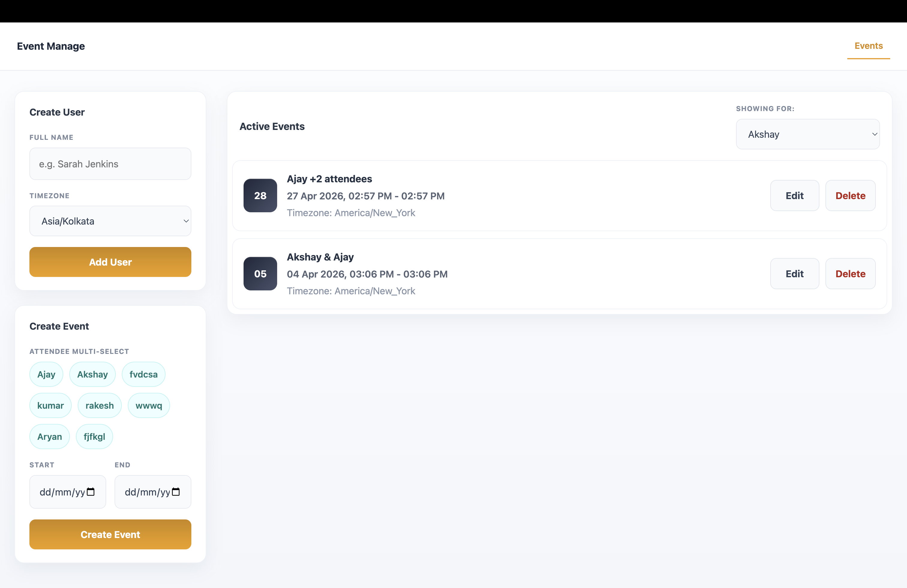

# Event Manage

A simple full-stack event management app built with React, Express, and MongoDB.

The app lets you:

- create users with a name and timezone
- schedule an event for one or more users
- store event times in UTC
- view events for a selected user in that user's timezone
- edit or delete existing events

That is the project. There is no authentication, calendar sync, notifications, or analytics layer in the current version.

## Why I built it this way

I wanted to build a small project that focuses on one real problem instead of adding random features: handling event times across different timezones without making the UI confusing.

The main implementation decision was:

- accept time input in the selected timezone
- convert it to UTC on the backend before saving
- convert it back to the selected user's timezone when showing it in the UI

That keeps storage consistent and makes the displayed schedule easier to understand.

## Current feature set

### Users

- create a user with a name
- assign one of the supported timezones:
  - `UTC`
  - `Asia/Kolkata`
  - `America/New_York`
  - `Europe/London`
- if a user with the same name already exists, the backend returns the existing user instead of creating a duplicate

### Events

- create an event for one or more users
- choose start and end date-time values
- fetch events for a selected user
- edit an event's start and end time
- delete an event

### Validation currently implemented

- user name is required
- event fields are required
- event start time cannot be in the past
- event end time must be after the start time

## Tech stack

### Frontend

- React
- Vite
- plain CSS
- `fetch` for API calls
- `dayjs` with timezone plugins for formatting

### Backend

- Express
- MongoDB
- Mongoose
- `dayjs` for UTC and timezone conversion

## Project structure

```text
event-manager/
├── backend/
│   ├── db/
│   ├── routes/
│   └── server/
└── frontend/
    └── src/
```

## How it works

### Frontend

The frontend is a single-page React app.

- `frontend/src/App.jsx` holds the main UI and local state
- users and events are fetched from the backend with small helper functions from `frontend/src/api.js`
- editing is handled inline in the event list
- the currently selected user decides which timezone is used when events are displayed

### Backend

The backend exposes a small REST API.

#### User routes

- `GET /users` returns all users
- `GET /users?name=...` returns a matching user
- `POST /users` creates a user

#### Event routes

- `GET /events/user/:userId` returns all events for one user
- `POST /events` creates an event
- `PUT /events/:eventId` updates an event
- `DELETE /events/:eventId` deletes an event

### Data model

#### User

- `name`
- `email` optional, currently unused in the UI
- `timezone`

#### Event

- `profileIds`
- `startUTC`
- `endUTC`
- `createdAtUTC`
- `updatedAtUTC`

## Running locally

### 1. Install dependencies

```bash
cd backend
npm install

cd ../frontend
npm install
```

### 2. Add environment variables

Backend expects:

```env
MONGO_URI=your_mongodb_connection_string
PORT=5000
```

Frontend expects:

```env
VITE_BACKEND_URL=http://localhost:5000
```

### 3. Start the backend

```bash
cd backend
npm run dev
```

### 4. Start the frontend

```bash
cd frontend
npm run dev
```

## What I would improve next

If I continued this project, the next practical steps would be:

- add conflict detection between overlapping events
- support more timezones
- improve form validation and feedback
- add tests for route logic and time conversion
- split the React UI into smaller components

## Notes

- event storage is UTC-based
- displayed event times depend on the selected user's timezone
- there are currently no automated tests in the repo

## Screenshot

Current UI lives in the React frontend and focuses on three flows:

- creating users
- creating events
- managing existing events

This project is intentionally small, but the core logic is real and the timezone handling is the most important part of the implementation.



